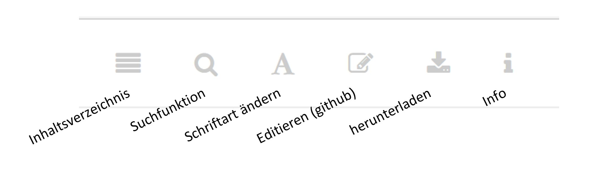

--- 
title: "Guitar Songbook"
author: "Nils Ratnaweera"
date: "`r Sys.Date()`"
site: bookdown::bookdown_site
documentclass: book
link-citations: yes
description: "My Songbook"
---

<!-- # Allgemein -->



```{r, include=FALSE}
knitr::opts_chunk$set(echo=FALSE, warning=FALSE)
```

```{r}
suppressMessages(library(tabr))
suppressMessages(library(dplyr))
suppressMessages(library(purrr))
suppressMessages(library(ggplot2))
suppressMessages(library(stringr))
suppressMessages(library(gridExtra))

guitarChords <- guitarChords %>%
  mutate(
    fretboard2 = map(fretboard,~as.vector(str_split_fixed(.x,";",7))[1:6]),
    mute = map(fretboard2,~.x == "x"),
    fretboard2 = map(fretboard2,~as.integer(ifelse(.x=="x" | .x == "o",0,.x)))
    )

fretboard_plot2 <- function(chord_root, chord_id, nr = 1,fret_range = NULL,show_tuning = FALSE,labels = NULL){
  chords <- guitarChords %>%
    dplyr::filter(root == chord_root & id == chord_id) %>%
    dplyr::slice(nr)
  
  chord_name <- paste0(toupper(chord_root),ifelse(chord_id == "M","",chord_id))
  
  fretboard_plot(6:1,chords$fretboard2[[1]],labels = labels, mute = chords$mute[[1]], fret_range = fret_range,show_tuning = show_tuning) +
    labs(tag = chord_name)
}
```

