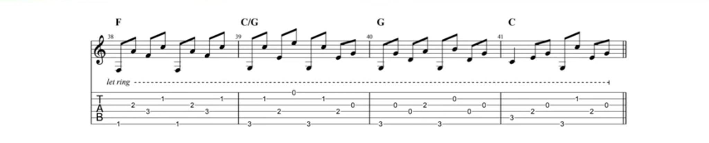
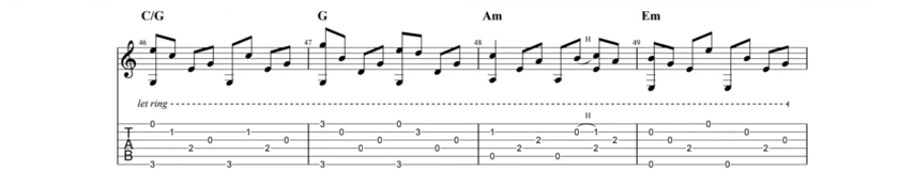

--- 
title: ""
pagetitle: "Songs"
site: bookdown::bookdown_site
documentclass: book
link-citations: yes
---


```{r, include=FALSE}
knitr::opts_chunk$set(echo=FALSE, warning=FALSE, dev.args=list(bg = "transparent"))
```

```{r, results="asis"}
output <- knitr::opts_knit$get("rmarkdown.pandoc.to")# html / latex / docx

if(output == "html"){
  pander::pandoc.header("Songs {-}",1)
  pander::pandoc.image("misc/title.png")
}

```

A collection of hand picked songs. This book is hosted as an online version on https://ratnanil.github.io/Songs/ and includes pdf / epub versions (click on the download symbol). Edits and feedback can be made via the [github repo](https://github.com/ratnanil/songs). The current version was rendered on `r Sys.time()`. 


```{r, include=FALSE}
file.create("docs/.nojekyll")

suppressMessages(library(tabr))
suppressMessages(library(dplyr))
suppressMessages(library(purrr))
suppressMessages(library(ggplot2))
suppressMessages(library(stringr))
suppressMessages(library(gridExtra))
suppressMessages(library(cowplot))
```


```{r}
# A wrapper around tabr::plot_chord() which allows multiple chords and styles them in my specific way (4 columns, transparent background etc.)
plot_chords <- function(chords){
  # Get the maximum fret-delta of all chords
  delta_max <- map_int(chords,function(x){
    v <- suppressWarnings(as.integer(str_split(x,"",simplify = TRUE)))
    max(v,na.rm = TRUE)-min(v, na.rm = TRUE)
  }) %>%
    max()
  
  # Make a list of all chord plots
  plots <- imap(chords,function(x,y){
    v <- min(suppressWarnings(as.integer(str_split(x,"",simplify = TRUE))),na.rm = TRUE)
    
    plot_chord(x,
               labels = NULL,
               fret_range = c(v,v+delta_max), # so that all chords span the same nr of frets
               point_size = 4,
               label_size = 3) + 
      labs(tag = y) +
      theme(
        panel.background = element_rect(fill = "transparent"), # The theme 
        plot.background = element_rect(fill = "transparent", color = NA), # bg of the plot
      )
    })
  chordnames <- map(chords, ~.x[2])
  plot_grid(plotlist = plots,ncol = 4)
}
```


```{r}
# Transform all songs in songs_txt into markdown files

songs <- list.files("songs_txt/",pattern = ".txt",full.names = T)

for (song in songs){
  song_bn <- basename(song)
  
  song_md <- str_replace(song_bn,".txt",".md")
  
  fileConn<-file(paste0("songs_md/",song_md))

  # TODO: specify encodings, apperentyl there was an issue with the "a" in vis-a-vis
  readLines(song, warn = FALSE) %>%
    map(~paste0(.x,"\\")) %>%
    str_replace_all("\\s","&nbsp;") %>%
    str_replace_all("\\*","\\\\*") %>%
    str_replace_all("\\_","\\\\_") %>%
    writeLines(fileConn)
  
  close.connection(fileConn)
  
}

```

# Selected Songs

## Wagon Wheel - Old Clow Medicine Show

```{r child = 'songs_md/wagon_wheel.md'}
```

## Viva la Vida - Coldplay

```{r child = 'songs_md/viva_la_vida.md'}
```

## Suzanne - Leonard Cohen

```{r child = 'songs_md/suzanne.md'}
```

```{r}
plot_chords(list("F#m" = "244222", "G#m" = "466444"))
```

## New Slang - The Shins

```{r child = 'songs_md/new_slang.md'}
```

## Jar of Hearts - Christina Perri

```{r child = 'songs_md/jar_of_hearts.md'}
```

```{r}
plot_chords(list("Bm" = "x24432", "Gm" = "355333", "F#" = "244322"))
```


## I will follow you - Deathcab for Cutie

```{r child = 'songs_md/i_will_follow_you_into_the_dark.md'}
```

## Build me up Buttercup - The Foundations

```{r child = 'songs_md/build_me_up_buttercup.md'}
```

## Hallelujah - Leonard Cohen

```{r child = 'songs_md/hallelujah.md'}
```

## Mad World - Gary Jules

```{r child = 'songs_md/mad_world.md'}
```

## Dance me to the end of Love - Leonard Cohen

```{r child = 'songs_md/dance_me_to_the_end_of_love.md'}
```

## For the Windows in Paradise - Sufjan Stevens

```{r child = 'songs_md/windows_in_paradise.md'}
```

## All the World is Green - Tom Waits

```{r child = 'songs_md/all_the_world_is_green.md'}
```

During the chorus:
```{r}
plot_chords(list("Bm" = "224432",
                 "Em" = "779987",
                 "A7" = "575655",
                 "D" = "557775",
                 "G7" = "353433"))

```


# Guitar Classics


## Lemon Tree - Fool's Garden

```{r child = 'songs_md/lemon_tree.md'}
```

## Boulevard of Broken Dreams - Green Day

```{r child = 'songs_md/boulevard_of_broken_dreams.md'}
```

## Wind of Change - Scorpions

```{r child = 'songs_md/wind_of_change.md'}
```

## Calafornia Dreaming - The Mamas \& The Papas

```{r child = 'songs_md/calafornia_dreaming.md'}
```

## The House of the Rising Sun - The Animals

```{r child = 'songs_md/house_of_the_rising_sun.md'}
```

## Blowing in the Wind - Bob Dylan

```{r child = 'songs_md/blowing_in_the_wind.md'}
```

## Streets of London - Ralph McTell

```{r child = 'songs_md/streets_of_london.md'}
```

## Where have all the flowers gone - Peter Paul and Mary

```{r child = 'songs_md/where_have_all_the_flowers_gone.md'}
```

## Sound of Silence - Simon \& Garfunkel

```{r child = 'songs_md/sound_of_silence.md'}
```

## Dust in the Wind - Kansas

```{r child = 'songs_md/dust_in_the_wind.md'}
```

## Sweet Home Alabama - Lynyrd Skynyrd

```{r child = 'songs_md/sweet_home_alabama.md'}
```

```{r}
plot_chords(list("Cadd9" = "x32030"))
```

## Moring has Broken - Cat Stevens

```{r child = 'songs_md/morning_has_broken.md'}
```

## Annies Song - John Denver

```{r child = 'songs_md/annies_song.md'}
```

## Hurt - Johnny Cash

```{r child = 'songs_md/hurt.md'}
```


# Mundart und Deutsch

## Kinder - So kleine Hände

```{r child = 'songs_md/so_kleine_haende.md'}
```

## S'Zundhölzli - Mani Matter

```{r child = 'songs_md/s_zundhoelzli.md'}
```

## Heidi - Mani Matter

```{r child = 'songs_md/heidi.md'}
```

## Dr Alpeflug - Mani Matter

```{r child = 'songs_md/dr_alpeflug.md'}
```

## Alls wo mir id Finger chunnt - Mani Matter

```{r child = 'songs_md/alls_wo_mir_id_finger_chunnt.md'}
```

## Bim Coiffeur - Mani Matter

```{r child = 'songs_md/bim_coiffeur.md'}
```

## Hemmige - Mani Matter

```{r child = 'songs_md/hemmige.md'}
```

## Dr Wecker - Mani Matter

```{r child = 'songs_md/dr_wecker.md'}
```

## Arabisch - Mani Matter

```{r child = 'songs_md/arabisch.md'}
```

## Eskimo - Mani Matter

```{r child = 'songs_md/eskimo.md'}
```

## S'nüüni Tramm - Mani Matter

```{r child = 'songs_md/nueni_tramm.md'}
```

## Bergvagabunden

```{r child = 'songs_md/bergvagabunden.md'}
```

## Ein Bett im Kornfeld

```{r child = 'songs_md/ein_bett_im_kornfeld.md'}
```

## Der Traum vom Fliegen - Alexandra

```{r child = 'songs_md/der_traum_vom_fliegen.md'}
```

## Das Testament - Sarah Lesch

```{r child = 'songs_md/das_testament.md'}
```

## Sie hört Musik nur wenn sie laut ist - Herbert Grönemeyer

```{r child = 'songs_md/sie_hoert_musik_nur_wenn_sie_laut_ist.md'}
```

## Kaspar - Reinhard Mey

```{r child = 'songs_md/kaspar.md'}
```

## Heute hier morgen dort - Hannes Wader

<!-- Akkrode wären auch in dasDING vorhanden -->

```{r child = 'songs_md/heute_hier_morgen_dort.md'}
```


# Weihnachtslieder


## Silent Night

```{r child = 'songs_md/silent_night.md'}
```

## Oh Holy Night

```{r child = 'songs_md/oh_holy_night.md'}
```

## Mary's Bornchild

```{r child = 'songs_md/marys_bornchild.md'}
```

## Oh Come all Ye Faithful

```{r child = 'songs_md/oh_come_all_ye_faithful.md'}
```

## The First Noel

```{r child = 'songs_md/the_first_noel.md'}
```

## Leise rieselt der Schnee

```{r child = 'songs_md/leise_rieselt_der_schnee.md'}
```

## Ihr Kinderleit Kommet

```{r child = 'songs_md/ihr_kinderleit_kommet.md'}
```

## Süsser die Glocken nie klingen

```{r child = 'songs_md/suesser_die_glocken_nie_klingen.md'}
```

## Am Weihnachtsbaume die Lichter brennen

```{r child = 'songs_md/am_weihnachtsbaume_die_lichter_brennen.md'}
```

## Oh du Fröhliche

```{r child = 'songs_md/oh_du_froehliche.md'}
```

## Oh Tannenbaum

```{r child = 'songs_md/oh_tannenbaum.md'}
```

## Kommet ihr Hirten

```{r child = 'songs_md/kommet_ihr_hirten.md'}
```


# Notes and Tabs

## Mad World - Gary Jules


## All My Loving - The Beatles


## Godfather Theme


## Streets of London - Ralph McTell

### Tabs







### Video

```{r}
knitr::include_url("https://youtu.be/AeR_tI47gZY")
```


